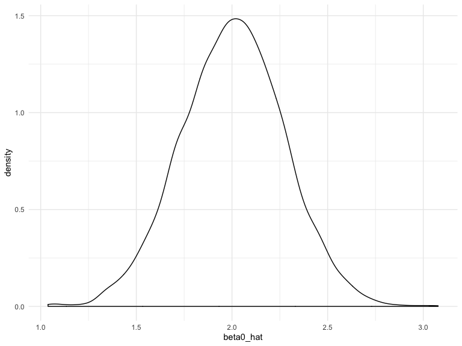
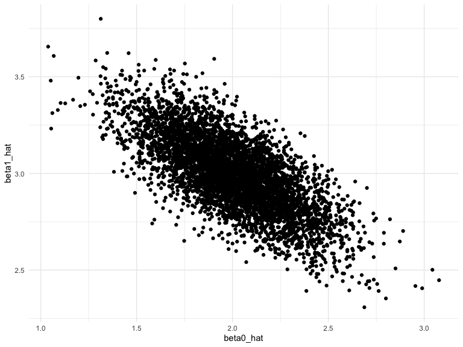
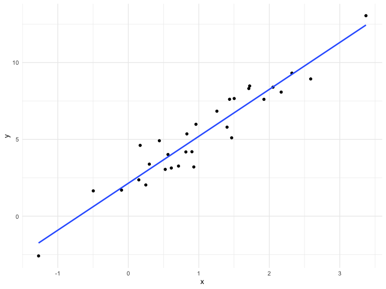
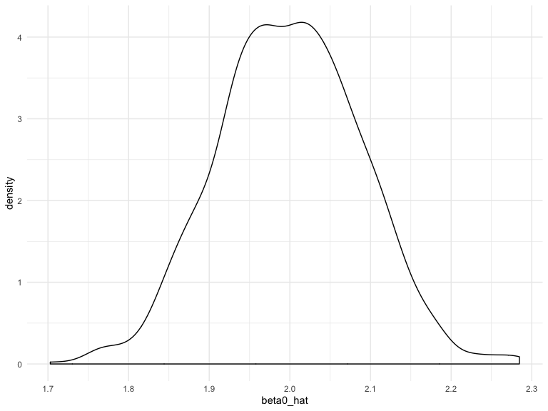

Simulation
================
Ashley Tseng
10/31/2019

## Simulation: Simple Linear Regression (SLR) for one *n*

``` r
set.seed(1)
```

#### Re-use function:

``` r
sim_regression = function(n, beta0 = 2, beta1 = 3) {
  
  sim_data = tibble(
    x = rnorm(n, mean = 1, sd = 1),
    y = beta0 + beta1 * x + rnorm(n, 0, 1)
  )
  
  ls_fit = lm(y ~ x, data = sim_data)
  
  tibble(
    beta0_hat = coef(ls_fit)[1],
    beta1_hat = coef(ls_fit)[2]
  )
}
```

``` r
sim_regression(n = 30)
```

    ## # A tibble: 1 x 2
    ##   beta0_hat beta1_hat
    ##       <dbl>     <dbl>
    ## 1      2.09      3.04

## Re-run using a for loop

``` r
output = vector("list", length = 5000)

for (i in 1:5000) {
  output[[i]] = sim_regression(n = 30)
}

sim_results = 
  bind_rows(output) %>% 
  ggplot(aes(x = beta0_hat)) +
  geom_density()
```

If you have a list of tibbles and all of those tibbles have the same
structure, then can use `bind_rows` to stack them together. Is cleaner.

## Re-run simulation using `purrr::rerun` function

``` r
output = 
  rerun(5000, sim_regression(30)) %>% 
  bind_rows()

bind_rows(output) %>% 
  ggplot(aes(x = beta0_hat)) +
  geom_density()
```



## Another plot

``` r
output %>% 
  ggplot(aes(x = beta0_hat, y = beta1_hat)) + 
  geom_point()
```


It’s a weird thing that the estimates of beta0 and beta1 are correlated
- this is not something we would expect.

#### What’s going on here?

``` r
sim_data = tibble(
    x = rnorm(30, mean = 1, sd = 1),
    y = 2 + 3 * x + rnorm(30, 0, 1)
  )

sim_data %>% 
  ggplot(aes(x = x, y = y)) +
  geom_point() +
  stat_smooth(method = "lm", se = FALSE)
```


If you get a difference in your estimated dataset, then you will get a
difference in your estimated slope. If you wanted to do a hypothesis
test of all coefficients at the same time, note that this would not be
the same as testing all the coefficients separately.

## Making a table for our outputs

``` r
output %>% 
  pivot_longer(
    beta0_hat:beta1_hat,
    names_to = "parameter",
    values_to = "estimate") %>% 
  group_by(parameter) %>% 
  summarize(emp_mean = mean(estimate),
            emp_var = var(estimate)) %>% 
  knitr::kable(digits = 3)
```

| parameter  | emp\_mean | emp\_var |
| :--------- | --------: | -------: |
| beta0\_hat |     2.005 |    0.072 |
| beta1\_hat |     2.995 |    0.037 |

## Try another sample size: SLR for several *n*s

``` r
n_list = list("n_30"  = 30, 
              "n_60"  = 60, 
              "n_120" = 120, 
              "n_240" = 240)

output = vector("list", length = 4)

for (i in 1:4) {
  output[[i]] = rerun(1000, sim_regression(n = n_list[[i]])) %>% 
    bind_rows
}

output[[4]] %>% 
  ggplot(aes(x = beta0_hat)) +
  geom_density()
```


Takeaway message: in a SLR, if your sample size goes from 30 to 240, on
average you will get the same distribution, but your range will narrow
(shrinking the variability with greater n).

The vector function is the generic way of creating a (empty) list in
R.

## But we can do this without a for loop\! We want to take the results from the for loop we just ran and put it into something more nicely structured.

``` r
sim_results = 
  tibble(sample_size = c(30, 60, 120, 240)) %>% 
  mutate(
    output_list = map(.x = sample_size, ~ rerun(1000, sim_regression(n = .x))),
    output_df = map(output_list, bind_rows)
    ) %>% 
  select(-output_list) %>% 
  unnest(output_df)
```

We can use tibble to create a data frame without multiple lists floating
around.
