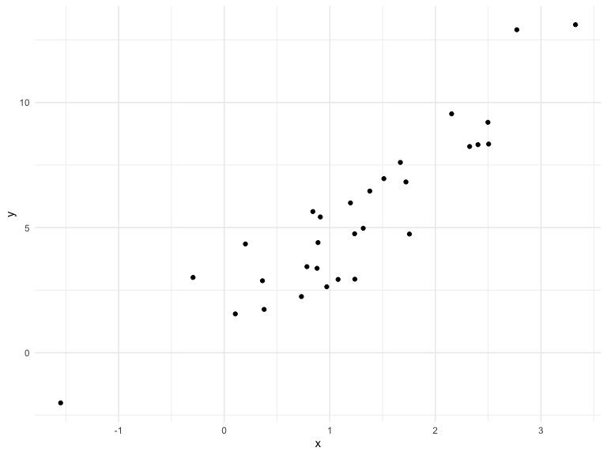

Writing Functions
================
Ashley Tseng
10/24/2019

## Getting Started

``` r
x_arg = rnorm(n = 30, mean = 4, sd = 2.3)
x_again = rnorm(n = 30, mean = 6, sd = 0.3)
y = rnorm(n = 30, mean = 5, sd = 2)

(x_arg - mean(x_arg)) / sd(x_arg)
```

    ##  [1]  0.02137932 -0.52946575  1.00594060 -1.21365976 -0.15527893
    ##  [6]  0.29872142  2.23475206  0.19589586 -0.57888883  0.83675566
    ## [11] -1.07932196 -0.06091371  0.53940570 -1.05388901 -1.89916380
    ## [16] -0.88864390 -0.83152343  0.35723524 -0.19763768  0.83525819
    ## [21]  1.23141800 -0.02548090  0.77500209 -0.97208116 -1.78110234
    ## [26]  1.24865157  1.73793795 -0.26454829  0.66493827 -0.45169248

``` r
(x_again - mean(x_again)) / sd(x_again)
```

    ##  [1] -0.54624977  0.54651030  0.88272896 -0.16740211  2.99507871
    ##  [6] -0.43770271 -0.52937273  0.35792777 -1.07501374 -1.31599701
    ## [11]  0.43368656  1.08833981  1.02390825 -0.31714860  0.85484984
    ## [16] -1.00414928 -1.37445428  1.21834914 -1.17046629  0.69737396
    ## [21] -1.49864021  0.99007247 -1.02175592 -0.24613088 -0.24915874
    ## [26]  0.48513147  0.41935286  0.07744822 -0.23195733 -0.88515873

This is what we would normally do (pre-functions): Every time we want to
calculate the z-scores of x’s that have different mean and sd, we would
need to change `x` to `x_again`. We can write a function to make this
process more efficient.

## My First Function

``` r
z_scores = function(x_arg) {
  
  z = (x_arg - mean(x_arg)) / sd(x_arg)
  z
  
}

z_scores(x_arg)
```

    ##  [1]  0.02137932 -0.52946575  1.00594060 -1.21365976 -0.15527893
    ##  [6]  0.29872142  2.23475206  0.19589586 -0.57888883  0.83675566
    ## [11] -1.07932196 -0.06091371  0.53940570 -1.05388901 -1.89916380
    ## [16] -0.88864390 -0.83152343  0.35723524 -0.19763768  0.83525819
    ## [21]  1.23141800 -0.02548090  0.77500209 -0.97208116 -1.78110234
    ## [26]  1.24865157  1.73793795 -0.26454829  0.66493827 -0.45169248

### Try Out The Function

``` r
z_scores(x_arg = x_again)
```

    ##  [1] -0.54624977  0.54651030  0.88272896 -0.16740211  2.99507871
    ##  [6] -0.43770271 -0.52937273  0.35792777 -1.07501374 -1.31599701
    ## [11]  0.43368656  1.08833981  1.02390825 -0.31714860  0.85484984
    ## [16] -1.00414928 -1.37445428  1.21834914 -1.17046629  0.69737396
    ## [21] -1.49864021  0.99007247 -1.02175592 -0.24613088 -0.24915874
    ## [26]  0.48513147  0.41935286  0.07744822 -0.23195733 -0.88515873

``` r
z_scores(x_arg = y)
```

    ##  [1] -0.25125601 -1.04624364 -0.30696849  1.28069657 -0.11134362
    ##  [6]  0.12151049 -1.30516790 -0.59125703 -0.96130466  1.48116907
    ## [11]  0.48395231 -1.11974796 -0.47414201  0.13194311  1.32695844
    ## [16] -1.43486068  0.88100390  0.34991218 -0.47302771  0.08874452
    ## [21] -0.45286294  2.02130102 -1.64747132 -0.18174193  0.67572920
    ## [26]  1.24403773 -0.79575607  1.79111791 -1.09841174  0.37348726

``` r
z_scores(x_arg = 3)
```

    ## [1] NA

``` r
z_scores(x_arg = "my name is jeff")
```

    ## Error in x_arg - mean(x_arg): non-numeric argument to binary operator

``` r
z_scores(x_arg = c(TRUE, TRUE, FALSE, TRUE))
```

    ## [1]  0.5  0.5 -1.5  0.5

``` r
z_scores(x_arg = iris)
```

    ## Error in is.data.frame(x): (list) object cannot be coerced to type 'double'

We have a function with a singular argument x. Any time the function is
lookking for x, R will look back at `function(x)` and figure out what
the user told it `x` was.

### Making modifications to the function to see when the function breaks

``` r
z_scores = function(x_arg) {
  
  if (!is.numeric(x_arg)) {
    stop("Argument x should be numeric")
  } else if (length(x_arg) == 1) {
    stop("Z scores cannot be computed for length 1 vectors")
  }
  
  z = mean(x_arg) / sd(x_arg)
  
  z
}
```

## Multiple Outputs

``` r
mean_and_sd = function(input_x) {
  
  if (!is.numeric(input_x)) {
    stop("Argument x should be numeric")
  } else if (length(input_x) == 1) {
    stop("Cannot be computed for length 1 vectors")
  }

tibble(
  mean_x = mean(input_x),
  sd_x = sd(input_x)
)

list(
  mean = mean_x, 
  sd = sd_x,
  z_score = (input_x = mean(input_x))/sd(input_x)
  )
}

mean_and_sd(input_x)
```

    ## Error in mean_and_sd(input_x): object 'input_x' not found

### Test out the mean\_and\_sd function

``` r
mean_and_sd(input_x = y)
```

    ## Error in mean_and_sd(input_x = y): object 'mean_x' not found

## Multiple Inputs

``` r
sim_data = tibble(
  x = rnorm(30, mean = 1, sd = 1),
  y = 2 + 3 * x + rnorm(30, 0, 1)
)

sim_data %>%
  ggplot(aes(x=x, y=y)) +
  geom_point() 
```



``` r
ls_fit = lm(y ~ x, data = sim_data)
  
beta0_hat = coef(ls_fit)[1]
beta1_hat = coef(ls_fit)[2]
```

beta0\_hat extracts the intercept, beta1\_hat extracts the slope

### Using a function

``` r
sim_regression = function(n, beta0 = 2, beta1 = 3) {
  
  sim_data = tibble(
    x = rnorm(n, mean = 1, sd = 1),
    y = beta0 + beta1 * x + rnorm(n, 0, 1)
  )
  
  ls_fit = lm(y ~ x, data = sim_data)
  
  tibble(
    beta0_hat = coef(ls_fit)[1],
    beta1_hat = coef(ls_fit)[2]
  )
}

sim_regression(n = 3000, beta0 = 17, beta1 = -3)
```

    ## # A tibble: 1 x 2
    ##   beta0_hat beta1_hat
    ##       <dbl>     <dbl>
    ## 1      17.0     -2.99

``` r
sim_regression(n = 14, beta0 = 24)
```

    ## # A tibble: 1 x 2
    ##   beta0_hat beta1_hat
    ##       <dbl>     <dbl>
    ## 1      24.2      2.78

Note that in R, you don’t have to name your arguments (R will just
assume that the values are in the order of the order that you entered
them in \[chronological\]). The following are the same:

``` r
sim_regression(n = 3000, beta0 = 17, beta1 = -3)
```

    ## # A tibble: 1 x 2
    ##   beta0_hat beta1_hat
    ##       <dbl>     <dbl>
    ## 1      17.0     -3.00

``` r
sim_regression(3000, 17, -3)
```

    ## # A tibble: 1 x 2
    ##   beta0_hat beta1_hat
    ##       <dbl>     <dbl>
    ## 1      17.0     -2.99
